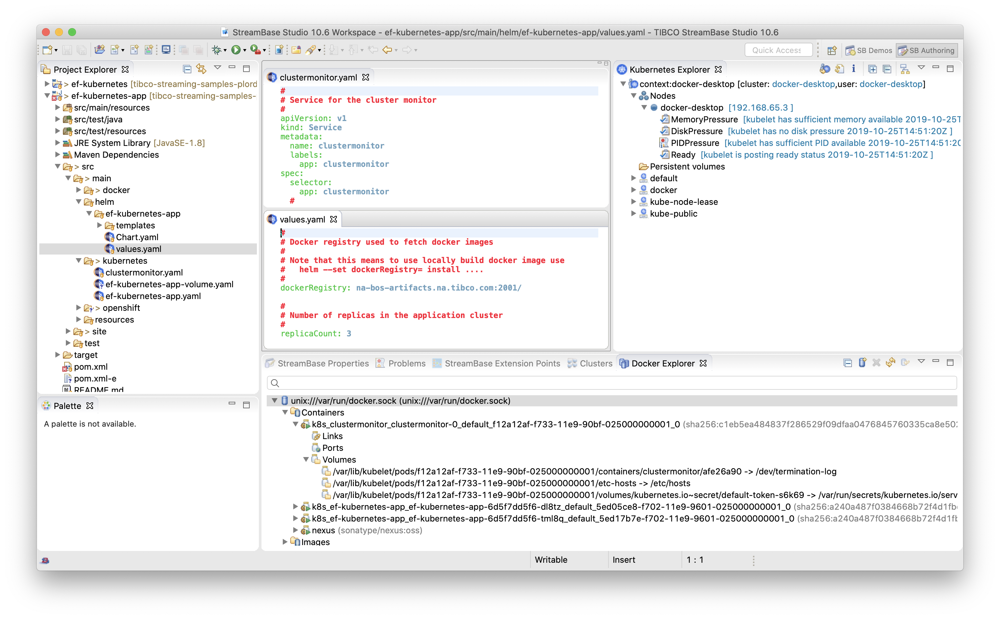

# Docker : Kubernetes EventFlow

This sample describes how to deploy an application archive containing an EventFlow fragment to Docker using 
Kubernetes.  The primary focus is desktop development, ie testing of application images in a desktop Kubernetes 
node.

* [Prerequisites](#prerequisites)
* [Creating an application archive project for Kubernetes from TIBCO StreamBase Studio&trade;](#creating-an-application-archive-project-for-kubernetes-from-tibco-streambase-studio-trade)
* [Containers and nodes](#containers-and-nodes)
* [Building and running from TIBCO StreamBase Studio&trade;](#building-and-running-from-tibco-streambase-studio-trade)
* [Building this sample from the command line and running the integration test cases](#building-this-sample-from-the-command-line-and-running-the-integration-test-cases)
* [Further kubernetes commands](#further-kubernetes-commands)

**FIX THIS - TO-DO :**

* Consider volumes for storage ( application archive / node deployment configuration / substitution files etc )
* Helm - better options to configure port numbers etc for testing
* Try on multi-node servers - discovery issues ?

<a name="prerequisites"></a>

## Prerequisites

In addition to docker (see [main docker sample](../../../../../ef-2node/ef-2node-app/src/site/markdown/index.md) ), Kubernetes is also required to be
installed and configured.  There are several options.

### Docker for desktop

When using docker desktop, this can most easily be achieved by enabling Kubernetes :


Validate that *docker-for-desktop* is the current context :

```
$ kubectl config current-context
docker-for-desktop
```

Docker for desktop only supports a single node.

### Minikube

An alternative is *minikube* - see https://kubernetes.io/docs/setup/learning-environment/minikube/ 
for installation instructions.  Validate that *minikube* is the current context :

```
$ kubectl config current-context
minikube
```

Minikube only supports a single node.

### Kind

An alternative is *kind* - see https://kind.sigs.k8s.io/docs/user/quick-start/ for installation instructions. 
Since this is a docker-in-docker approach, its usage is different.

**FIX THS - need to add more details**

Kind supports a multiple nodes.


<a name="creating-an-application-archive-project-for-kubernetes-from-tibco-streambase-studio-trade"></a>

## Creating an application archive project for Kubernetes from TIBCO StreamBase Studio&trade;

Create a new StreamBase Project and enable both Docker and Kubernetes :

I'm thinking something like -

* Existing tickbox for docker
* New tickbox to enable Kubernetes ( depends on docker above )
* New tickbox to generate cluster monitor image ( depends on docker above ) - or maybe this stays as a sample ?
* New selector for different types of storage external to image, such as Kubernetes volumes

**FIX THIS - show animated gif of creating new project**

The resulting project contains maven rules for building a docker image containing the application and 
the necessary Kubernetes configurations for deployment.

The Kubernetes configurations include -

* [ef-kubernetes-app.yaml](../../../src/main/kubernetes/ef-kubernetes-app.yaml) - Kubernetes Service and StatefulSet definition for a scaling cluster
* [clustermonitor.yaml](../../../src/main/kubernetes/clustermonitor.yaml) - Kubernetes Service and StatefulSet definition for cluster monitor
* [security.conf](../../../src/main/configurations/security.conf) - Trusted hosts names need to match Kubernetes DNS names
* [start-node](../../../src/main/docker/base/start-node) - Script updated to set a default NODENAME if not set and to set node username and password
* [start-cluster-monitor](../../../src/main/docker/clustermonitor/start-cluster-monitor) - Script to start the cluster monitor

**FIX THIS - current version of Kitematic doesn't display container logs.  I've been using the older 0.17.6 from https://github.com/docker/kitematic/releases/download/v0.17.6/Kitematic-0.17.6-Mac.zip **

<a name="containers-and-nodes"></a>

## Containers and nodes

**FIX THIS - describe statefulstate ( this gives us sensible DNS/hostname, templates and scaling )**


<a name="building-and-running-from-tibco-streambase-studio-trade"></a>

## Building and running from TIBCO StreamBase Studio&trade;

Useful plugins include :

* [Kubernetes Manifest Editor](https://marketplace.eclipse.org/content/kubernetes-manifest-editor)
* [EKube](https://marketplace.eclipse.org/content/ekube)



<a name="building-this-sample-from-the-command-line-and-running-the-integration-test-cases"></a>

## Building this sample from the command line and running the integration test cases

Running *mvn install* will :

* Build the eventflow fragment
* Run eventflow fragment unit test cases
* Build the application archive that contains the eventflow fragment
* If docker is installed -
    * Build a base image containing just the product
    * Build a application docker image containing the application archive
    * Build a cluster monitor docker image
    * Run basic system test to validate configuration
* If docker is not installed -
    * Run basic system test cases natively

**FIX THIS - add animated gif**

To start the cluster use the *kubectl apply* command :

```
$ kubectl apply -f ef-kubernetes-app/src/main/kubernetes/ef-kubernetes-app.yaml 
service/ef-kubernetes-app created
statefulset.apps/ef-kubernetes-app created
```

The *kubectl describe* command gives further details :

```
$ kubectl describe service ef-kubernetes-app
Name:              ef-kubernetes-app
Namespace:         default
Labels:            app=ef-kubernetes-app
Annotations:       kubectl.kubernetes.io/last-applied-configuration:
                     {"apiVersion":"v1","kind":"Service","metadata":{"annotations":{},"labels":{"app":"ef-kubernetes-app"},"name":"ef-kubernetes-app","namespac...
Selector:          app=ef-kubernetes-app
Type:              ClusterIP
IP:                None
Session Affinity:  None
Events:            <none>

$ kubectl describe statefulset ef-kubernetes-app
Name:               ef-kubernetes-app
Namespace:          default
CreationTimestamp:  Mon, 14 Oct 2019 18:31:37 +0100
Selector:           app=ef-kubernetes-app
Labels:             <none>
Annotations:        kubectl.kubernetes.io/last-applied-configuration:
                      {"apiVersion":"apps/v1","kind":"StatefulSet","metadata":{"annotations":{},"name":"ef-kubernetes-app","namespace":"default"},"spec":{"repli...
Replicas:           3 desired | 3 total
Update Strategy:    RollingUpdate
  Partition:        824638312156
Pods Status:        3 Running / 0 Waiting / 0 Succeeded / 0 Failed
Pod Template:
  Labels:  app=ef-kubernetes-app
  Containers:
   ef-kubernetes-app:
    Image:        docker/ef-kubernetes-app:1.0.0
    Port:         <none>
    Host Port:    <none>
    Liveness:     http-get http://:8008/healthcheck/v1/status delay=30s timeout=1s period=10s #success=1 #failure=3
    Readiness:    http-get http://:8008/healthcheck/v1/status delay=30s timeout=1s period=10s #success=1 #failure=3
    Environment:  <none>
    Mounts:       <none>
  Volumes:        <none>
Volume Claims:    <none>
Events:
  Type    Reason            Age   From                    Message
  ----    ------            ----  ----                    -------
  Normal  SuccessfulCreate  45m   statefulset-controller  create Pod ef-kubernetes-app-0 in StatefulSet ef-kubernetes-app successful
  Normal  SuccessfulCreate  44m   statefulset-controller  create Pod ef-kubernetes-app-1 in StatefulSet ef-kubernetes-app successful
  Normal  SuccessfulCreate  43m   statefulset-controller  create Pod ef-kubernetes-app-2 in StatefulSet ef-kubernetes-app successful
```

The configuration file defines 3 replicas and so 3 POD's were created ( ef-kubernetes-app-0, ef-kubernetes-app-1 and ef-kubernetes-app-2 ).

To view the logs use *kubectl logs* :

```
$ kubectl logs ef-kubernetes-app-0
[ef-kubernetes-app-0.ef-kubernetes-app]     Installing node
[ef-kubernetes-app-0.ef-kubernetes-app]         PRODUCTION executables
[ef-kubernetes-app-0.ef-kubernetes-app]         Memory shared memory
[ef-kubernetes-app-0.ef-kubernetes-app]         6 concurrent allocation segments
[ef-kubernetes-app-0.ef-kubernetes-app]         Host name ef-kubernetes-app-0
[ef-kubernetes-app-0.ef-kubernetes-app]         Container tibco/sb
[ef-kubernetes-app-0.ef-kubernetes-app]         Starting container services
[ef-kubernetes-app-0.ef-kubernetes-app]         Loading node configuration
[ef-kubernetes-app-0.ef-kubernetes-app]         Auditing node security
[ef-kubernetes-app-0.ef-kubernetes-app]         Deploying application
[ef-kubernetes-app-0.ef-kubernetes-app]             Engine default-engine-for-com.tibco.ep.samples.docker.ef-kubernetes-ef
[ef-kubernetes-app-0.ef-kubernetes-app]         Application deployed
[ef-kubernetes-app-0.ef-kubernetes-app]         Administration port is 2000
[ef-kubernetes-app-0.ef-kubernetes-app]         Discovery Service running on port 54321
[ef-kubernetes-app-0.ef-kubernetes-app]         Service name is ef-kubernetes-app-0.ef-kubernetes-app
[ef-kubernetes-app-0.ef-kubernetes-app]     Node installed
[ef-kubernetes-app-0.ef-kubernetes-app]     Starting node
[ef-kubernetes-app-0.ef-kubernetes-app]         Engine application::default-engine-for-com.tibco.ep.samples.docker.ef-kubernetes-ef started
[ef-kubernetes-app-0.ef-kubernetes-app]         Loading node configuration
[ef-kubernetes-app-0.ef-kubernetes-app]         Auditing node security
[ef-kubernetes-app-0.ef-kubernetes-app]         Host name ef-kubernetes-app-0
[ef-kubernetes-app-0.ef-kubernetes-app]         Administration port is 2000
[ef-kubernetes-app-0.ef-kubernetes-app]         Discovery Service running on port 54321
[ef-kubernetes-app-0.ef-kubernetes-app]         Service name is ef-kubernetes-app-0.ef-kubernetes-app
[ef-kubernetes-app-0.ef-kubernetes-app]     Node started
COMMAND FINISHED
```

epadmin commands can be run with *kubectl exec* :

```
$ kubectl exec ef-kubernetes-app-0 epadmin servicename=ef-kubernetes-app-0.ef-kubernetes-app display cluster
[ef-kubernetes-app-0.ef-kubernetes-app] Node Name = ef-kubernetes-app-2.ef-kubernetes-app
[ef-kubernetes-app-0.ef-kubernetes-app] Network Address = IPv4:ef-kubernetes-app-2:17318,IPv4:ef-kubernetes-app-2:17317
[ef-kubernetes-app-0.ef-kubernetes-app] Current State = Up
[ef-kubernetes-app-0.ef-kubernetes-app] Last State Change = 2019-10-14 12:59:46
[ef-kubernetes-app-0.ef-kubernetes-app] Number of Connections = 2
[ef-kubernetes-app-0.ef-kubernetes-app] Number of Queued PDUs = 0
[ef-kubernetes-app-0.ef-kubernetes-app] Discovered = Dynamic
[ef-kubernetes-app-0.ef-kubernetes-app] Location Code = 9439063122635943377

[ef-kubernetes-app-0.ef-kubernetes-app] Node Name = ef-kubernetes-app-1.ef-kubernetes-app
[ef-kubernetes-app-0.ef-kubernetes-app] Network Address = IPv4:ef-kubernetes-app-1:15968,IPv4:ef-kubernetes-app-1:15967
[ef-kubernetes-app-0.ef-kubernetes-app] Current State = Up
[ef-kubernetes-app-0.ef-kubernetes-app] Last State Change = 2019-10-14 12:59:43
[ef-kubernetes-app-0.ef-kubernetes-app] Number of Connections = 3
[ef-kubernetes-app-0.ef-kubernetes-app] Number of Queued PDUs = 0
[ef-kubernetes-app-0.ef-kubernetes-app] Discovered = Dynamic
[ef-kubernetes-app-0.ef-kubernetes-app] Location Code = 11990177587896688850
```

<a name="further-kubernetes-commands"></a>

## Further kubernetes commands

### Scaling the application

To scale up the cluster we can increase the number of replicas with the *kubectl scale* command :

```
$ kubectl scale statefulsets ef-kubernetes-app --replicas=4
statefulset.apps/ef-kubernetes-app scaled
```

The new node is discovered and added to the cluster :

```
$ kubectl exec ef-kubernetes-app-0 epadmin servicename=ef-kubernetes-app-0.ef-kubernetes-app display cluster
[ef-kubernetes-app-0.ef-kubernetes-app] Node Name = ef-kubernetes-app-3.ef-kubernetes-app
[ef-kubernetes-app-0.ef-kubernetes-app] Network Address = IPv4:ef-kubernetes-app-3:53214,IPv4:ef-kubernetes-app-3:53213
[ef-kubernetes-app-0.ef-kubernetes-app] Current State = Up
[ef-kubernetes-app-0.ef-kubernetes-app] Last State Change = 2019-10-14 13:16:59
[ef-kubernetes-app-0.ef-kubernetes-app] Number of Connections = 2
[ef-kubernetes-app-0.ef-kubernetes-app] Number of Queued PDUs = 0
[ef-kubernetes-app-0.ef-kubernetes-app] Discovered = Dynamic
[ef-kubernetes-app-0.ef-kubernetes-app] Location Code = 840900389728819536

[ef-kubernetes-app-0.ef-kubernetes-app] Node Name = ef-kubernetes-app-2.ef-kubernetes-app
[ef-kubernetes-app-0.ef-kubernetes-app] Network Address = IPv4:ef-kubernetes-app-2:17318,IPv4:ef-kubernetes-app-2:17317
[ef-kubernetes-app-0.ef-kubernetes-app] Current State = Up
[ef-kubernetes-app-0.ef-kubernetes-app] Last State Change = 2019-10-14 12:59:46
[ef-kubernetes-app-0.ef-kubernetes-app] Number of Connections = 2
[ef-kubernetes-app-0.ef-kubernetes-app] Number of Queued PDUs = 0
[ef-kubernetes-app-0.ef-kubernetes-app] Discovered = Dynamic
[ef-kubernetes-app-0.ef-kubernetes-app] Location Code = 9439063122635943377

[ef-kubernetes-app-0.ef-kubernetes-app] Node Name = ef-kubernetes-app-1.ef-kubernetes-app
[ef-kubernetes-app-0.ef-kubernetes-app] Network Address = IPv4:ef-kubernetes-app-1:15968,IPv4:ef-kubernetes-app-1:15967
[ef-kubernetes-app-0.ef-kubernetes-app] Current State = Up
[ef-kubernetes-app-0.ef-kubernetes-app] Last State Change = 2019-10-14 12:59:43
[ef-kubernetes-app-0.ef-kubernetes-app] Number of Connections = 3
[ef-kubernetes-app-0.ef-kubernetes-app] Number of Queued PDUs = 0
[ef-kubernetes-app-0.ef-kubernetes-app] Discovered = Dynamic
[ef-kubernetes-app-0.ef-kubernetes-app] Location Code = 11990177587896688850

```

Similarly, to scale down we can reduce the number of replicas with the *kubectl scale* command :

```
$ kubectl scale statefulsets ef-kubernetes-app --replicas=3
statefulset.apps/ef-kubernetes-app scaled
```

### Status

To check POD status use the *kubectl get* command :

```
$ kubectl get pod  
NAME                  READY   STATUS    RESTARTS   AGE
ef-kubernetes-app-0   1/1     Running   0          46m
ef-kubernetes-app-1   1/1     Running   0          45m
ef-kubernetes-app-2   1/1     Running   0          45m
```

### Healthcheck

Should a pod fail, the healthcheck should cause a re-start :

```
$ kubectl get pods 
NAME                  READY   STATUS    RESTARTS   AGE
ef-kubernetes-app-0   1/1     Running   0          55m
ef-kubernetes-app-1   1/1     Running   0          54m
ef-kubernetes-app-2   1/1     Running   1          53m
```

### Delete

To delete everything defined in the yaml file, use the *kubectl delete* command :

```
$ kubectl delete -f ef-kubernetes-app/src/main/kubernetes/ef-kubernetes-app.yaml 
service "ef-kubernetes-app" deleted
statefulset.apps "ef-kubernetes-app" deleted
```

Individual services and statefulsets can also be deleted :

```
$ kubectl delete service ef-kubernetes-app
service "ef-kubernetes-app" deleted

$ kubectl delete statefulset ef-kubernetes-app
statefulset.apps "ef-kubernetes-app" deleted
```

### Cluster monitor

To start the cluster monitor user the *kubectl apply* command to apply clustermonitor.yaml :

```
$ kubectl apply -f ef-kubernetes-app/src/main/kubernetes/clustermonitor.yaml 
service/clustermonitor created
statefulset.apps/clustermonitor created
```

This configuration uses *NodePort* to expose the web server externally.  Use the *kubectl describe service*
command to determine the mapped port :

```
$ kubectl describe service clustermonitor
Name:                     clustermonitor
Namespace:                default
Labels:                   app=clustermonitor
Annotations:              kubectl.kubernetes.io/last-applied-configuration:
                            {"apiVersion":"v1","kind":"Service","metadata":{"annotations":{},"labels":{"app":"clustermonitor"},"name":"clustermonitor","namespace":"de...
Selector:                 app=clustermonitor
Type:                     NodePort
IP:                       10.105.204.60
LoadBalancer Ingress:     localhost
Port:                     http  11080/TCP
TargetPort:               11080/TCP
NodePort:                 http  31044/TCP
Endpoints:                10.1.0.15:11080
Session Affinity:         None
External Traffic Policy:  Cluster
Events:                   <none>
```

In this case the URL http://localhost:31044 can be used to access the cluster monitor :


### Web UI Dashboard

### Docker for desktop

To start the Kubernetes dashboard in a *docker-for-desktop* context see https://kubernetes.io/docs/tasks/access-application-cluster/web-ui-dashboard :

```
$ kubectl apply -f https://raw.githubusercontent.com/kubernetes/dashboard/v2.0.0-beta4/aio/deploy/recommended.yaml
namespace/kubernetes-dashboard created
serviceaccount/kubernetes-dashboard created
service/kubernetes-dashboard created
secret/kubernetes-dashboard-certs created
secret/kubernetes-dashboard-csrf created
secret/kubernetes-dashboard-key-holder created
configmap/kubernetes-dashboard-settings created
role.rbac.authorization.k8s.io/kubernetes-dashboard created
clusterrole.rbac.authorization.k8s.io/kubernetes-dashboard created
rolebinding.rbac.authorization.k8s.io/kubernetes-dashboard created
clusterrolebinding.rbac.authorization.k8s.io/kubernetes-dashboard created
deployment.apps/kubernetes-dashboard created
service/dashboard-metrics-scraper created
deployment.apps/dashboard-metrics-scraper created

$ kubectl -n kubernetes-dashboard get secret
NAME                               TYPE                                  DATA   AGE
default-token-4nc9f                kubernetes.io/service-account-token   3      18s
kubernetes-dashboard-certs         Opaque                                0      18s
kubernetes-dashboard-csrf          Opaque                                1      18s
kubernetes-dashboard-key-holder    Opaque                                2      18s
kubernetes-dashboard-token-jq4z8   kubernetes.io/service-account-token   3      18s

$ kubectl -n kubernetes-dashboard describe secrets kubernetes-dashboard-token-jq4z8
Name:         kubernetes-dashboard-token-jq4z8
Namespace:    kubernetes-dashboard
Labels:       <none>
Annotations:  kubernetes.io/service-account.name: kubernetes-dashboard
              kubernetes.io/service-account.uid: 65fc5a3d-ee85-11e9-b8d1-025000000001

Type:  kubernetes.io/service-account-token

Data
====
token:      eyJhbGciOiJSUzI1NiIsImtpZCI6IiJ9.eyJpc3MiOiJrdWJlcm5ldGVzL3NlcnZpY2VhY2NvdW50Iiwia3ViZXJuZXRlcy5pby9zZXJ2aWNlYWNjb3VudC9uYW1lc3BhY2UiOiJrdWJlcm5ldGVzLWRhc2hib2FyZCIsImt1YmVybmV0ZXMuaW8vc2VydmljZWFjY291bnQvc2VjcmV0Lm5hbWUiOiJrdWJlcm5ldGVzLWRhc2hib2FyZC10b2tlbi1qcTR6OCIsImt1YmVybmV0ZXMuaW8vc2VydmljZWFjY291bnQvc2VydmljZS1hY2NvdW50Lm5hbWUiOiJrdWJlcm5ldGVzLWRhc2hib2FyZCIsImt1YmVybmV0ZXMuaW8vc2VydmljZWFjY291bnQvc2VydmljZS1hY2NvdW50LnVpZCI6IjY1ZmM1YTNkLWVlODUtMTFlOS1iOGQxLTAyNTAwMDAwMDAwMSIsInN1YiI6InN5c3RlbTpzZXJ2aWNlYWNjb3VudDprdWJlcm5ldGVzLWRhc2hib2FyZDprdWJlcm5ldGVzLWRhc2hib2FyZCJ9.IPOva4ok6-w2VrLNidNdREWUWlYvkN4hJ0Tw3Kfik8tD50aofAO2DRFuH6GkSO94FOSbSCRay8bRIECIIjxt8FUjXXInhe7sh32NRTYs_-yRARId5V0kIHP7lUKuXTQcg5cIg7GoCO0ZkWwfdxMhQnMBUVY_HMF1LQVOx_Etth72ujJbIVBoSbQNoenTdOl9xUCFsQa9O_fa33PK5Uv0PaCqAo9vBO4j8CMVpLcXgjN_nypNx6PgUGzcLAIRqvCf-s7RYVhR3njHN6H_VrH92G_NkszWkX2T5cPsXlX6cIEK_CHskaQ5MnZhRPobAmjz3nXRy-KNkratn3HfZwcIPQ
ca.crt:     1025 bytes
namespace:  20 bytes

$ kubectl proxy
```

The dashboard can be found at http://localhost:8001/api/v1/namespaces/kubernetes-dashboard/services/https:kubernetes-dashboard:/proxy/
with token credentials as exported above :


### Minikube

Starting the dashboard in a *minikube* context is via the *minikube dashboard* command :

```
$ minikube dashboard
🔌  Enabling dashboard ...
🤔  Verifying dashboard health ...
🚀  Launching proxy ...
🤔  Verifying proxy health ...
🎉  Opening http://127.0.0.1:57841/api/v1/namespaces/kubernetes-dashboard/services/http:kubernetes-dashboard:/proxy/ in your default browser...
```
